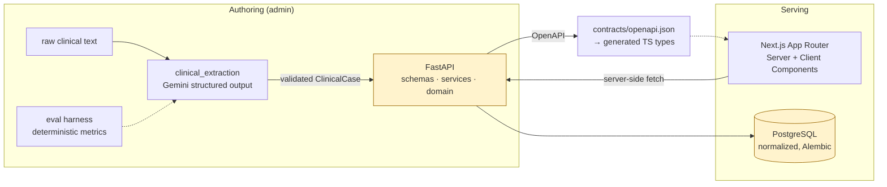
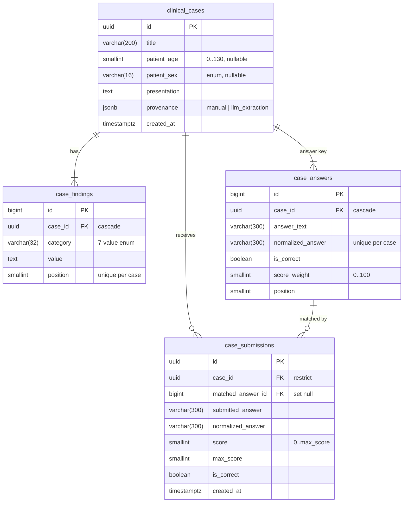

# Eximion Clinical Case Platform

One vertical slice, one domain contract:

```
raw clinical text ─► Gemini structured extraction ─► ClinicalCase ─► FastAPI ─► PostgreSQL
                                                                          │
                                   Next.js (Server Component) ◄───────────┘
                                   diagnosis ─► Server Action ─► deterministic scoring
```

A physician opens a case, submits a diagnosis, gets a score. Cases are written by hand
or extracted from free clinical text by an LLM. Both paths produce the same validated
`ClinicalCase`, so there is one schema, not two.

Eximion take-home assignment, all three tasks (FastAPI + PostgreSQL, Next.js +
TypeScript, LLM pipeline + GCP) in one repository: they are one system, not three.

## Architecture



**The answer key never leaves the backend.** `PublicClinicalCase` has no answer fields,
and the public read path does not even load the `answers` relationship. Checked three
ways: an API test on the raw HTTP body, a contract test on the published OpenAPI, and
the smoke test on the rendered HTML.

## Repository layout

```
backend/        FastAPI, SQLAlchemy 2, Alembic, pytest        (Python 3.12)
frontend/       Next.js App Router, TypeScript strict, vitest (Node 22)
llm_pipeline/   Gemini extraction, decision layer, local models, evals (Python 3.12)
contracts/      openapi.json — the shared contract, drift-checked in CI
infra/          DEPLOYMENT.md — Cloud Run + Cloud SQL runbook
scripts/        smoke.sh — end-to-end check of the real stack
docs/           IMPLEMENTATION_PLAN.md, REPORT.md
```

Three Dockerfiles: `backend` and `frontend` are services, `llm_pipeline` is a batch
container (a Cloud Run Job in production).

The interface is available in seven languages, including Arabic with a
right-to-left layout, and in a light and a dark theme. Clinical content is never
translated: a translated finding is a clinical claim, and this system should not
make one.

## Quick start

Requires Docker, and (for running from source) Python 3.12 with [uv](https://docs.astral.sh/uv/)
and Node 22.

```bash
git clone https://github.com/Sskutushev/eximion-clinical-case-platform.git
cd eximion-clinical-case-platform
cp .env.example .env            # local defaults work as-is

docker compose up -d --build --wait    # PostgreSQL → migrations → API → frontend
bash scripts/smoke.sh                  # proves the whole slice works
```

| URL | What |
|---|---|
| http://localhost:3000 | case list → case page → submit a diagnosis |
| http://localhost:8000/docs | interactive API (local/test only — disabled in production) |
| http://localhost:8000/health/ready | readiness, including the database |

Load ten demo cases to click through:

```bash
cd backend && uv sync && uv run python -m scripts.seed
```

### Running from source

```bash
docker compose up -d --wait postgres

cd backend
uv sync
uv run alembic upgrade head
uv run uvicorn app.main:create_app --factory --reload --port 8000

cd ../frontend
npm install
npm run dev                     # http://localhost:3000
```

`make help` lists every task (`make up`, `make migrate`, `make test`, `make types`,
`make eval`, `make smoke`, `make check`). On Windows without `make`, the commands in
each recipe run as-is in Git Bash or PowerShell.

## API

```bash
ADMIN=local-dev-admin-key

# Author a case (admin only; the answer key lives here)
curl -X POST localhost:8000/api/v1/cases \
  -H 'Content-Type: application/json' -H "X-Admin-API-Key: ${ADMIN}" \
  -d '{
    "title": "Acute right lower quadrant pain",
    "patient_age": 24, "patient_sex": "male",
    "presentation": "Migratory abdominal pain for 18 hours with nausea.",
    "findings": [
      {"category": "symptom", "value": "Pain migrating to the right lower quadrant"},
      {"category": "laboratory", "value": "White cell count 14.2 x10^9/L"}
    ],
    "answers": [
      {"text": "Acute appendicitis", "is_correct": true, "score_weight": 10},
      {"text": "Appendicitis", "is_correct": true, "score_weight": 10},
      {"text": "Mesenteric lymphadenitis", "is_correct": false, "score_weight": 3}
    ]
  }'
# → 201 {"id": "..."}  + Location header

# Read it as a participant — no answers, no is_correct, no score_weight
curl localhost:8000/api/v1/cases/<id>

# Submit a diagnosis; normalization makes this equal to "Acute appendicitis"
curl -X POST localhost:8000/api/v1/cases/<id>/score \
  -H 'Content-Type: application/json' -d '{"answer": "  ACUTE   Appendicitis. "}'
# → {"score": 10, "max_score": 10, "is_correct": true, "outcome": "correct", ...}
```

| Endpoint | Purpose |
|---|---|
| `POST /api/v1/cases` | author a case with its answer key (requires `X-Admin-API-Key`) |
| `GET /api/v1/cases` | list case summaries |
| `GET /api/v1/cases/{id}` | the case as a participant sees it |
| `POST /api/v1/cases/{id}/score` | score a diagnosis, persist the submission |
| `GET /health`, `/health/ready` | liveness, readiness |

## Data model



Rows, not a JSONB blob. Findings and answers are queryable; every enum and range is a
`CHECK`; answer uniqueness is a `UNIQUE`; `score <= max_score` is enforced by the
database, not trusted from the app. `JSONB` holds only optional extraction provenance.

Findings and answers cascade on delete. Submissions use `ON DELETE RESTRICT`: a case
with recorded attempts keeps its audit trail.

## Scoring

Deterministic and LLM-free. A submission is normalized
(`NFKC → casefold → collapse whitespace → strip edge punctuation`) and compared against
the stored normalized key:

| Submitted | Result |
|---|---|
| `Acute appendicitis` | 10/10 — correct |
| `  ACUTE   Appendicitis. ` | 10/10 — same key after normalization |
| `appendicitis` | 10/10 — accepted synonym (its own row) |
| `Mesenteric lymphadenitis` | 3/10 — partially correct (differential) |
| `Migraine` | 0/10 — incorrect |

Case-folding is Unicode-aware (`Straße` → `strasse`); inner punctuation is significant
(`type-2 diabetes` ≠ `type 2 diabetes`). Feedback gives the outcome, never the correct
answer: attempts can be repeated, so no endpoint may become an answer source.

## Shared types

FastAPI's OpenAPI document is the single source of truth. There are no hand-copied DTOs:

```bash
make types     # backend → contracts/openapi.json → frontend/src/generated/api.d.ts
```

Both artefacts are committed. CI regenerates them and fails on any diff, so the
contract cannot drift from the code. The frontend uses them through a typed
`openapi-fetch` client; `llm_pipeline` validates its output against the same document.

## Frontend

- **Server Component** (`/cases/[id]`) fetches and renders the case. `loading.tsx`,
  `not-found.tsx`, `error.tsx` cover the rest.
- **Client Component** owns the interaction only: the form, its pending and error
  states, the result. It never computes a score.
- Submission goes through a **Server Action**, so the browser never calls the API.
  `API_BASE_URL` is server-side only: no `NEXT_PUBLIC_*`, no CORS, no backend URL in
  the bundle.
- Backend failures are a typed result (`not_found | invalid | unavailable`), not thrown
  strings, so each is handled explicitly.

## LLM extraction pipeline

```bash
cd llm_pipeline && uv sync

uv run clinical-extraction eval --provider fake      # offline, no credentials, runs in CI
uv run clinical-extraction eval --provider gemini    # real Vertex AI / Gemini run
uv run clinical-extraction extract --file case.txt   # one case → POSTable JSON
```

Or in its container, which is what Cloud Run runs:

```bash
docker compose run --rm extraction eval --provider fake
```

- **Structured output, not parsing.** Gemini is constrained by `response_json_schema`
  at `temperature=0`. No regex, no markdown scraping.
- **Validation is mandatory.** Every response goes through Pydantic. A schema violation
  raises `SchemaValidationError`: not retried, not patched with a fallback. A bad
  clinical extraction has to be loud.
- **Retries are narrow.** Bounded backoff for transient errors (429/5xx) only; 4xx and
  safety blocks fail at once.
- **The model does not diagnose.** It records only diagnoses the text states, and
  returns `null` for an unstated age or sex instead of guessing.
- **Provider boundary.** A `Protocol` with a Gemini implementation and a fake one, so
  pipeline, harness and tests run with no network and no credentials.
- **Provenance.** Model name and prompt version travel with each extracted case.
- **Logging.** Field paths and error types, never clinical text.

### Eval methodology

`llm_pipeline/evals/dataset.jsonl`: 10 synthetic, de-identified vignettes with
hand-written ground truth. Covers synonym answer keys, differentials, all seven finding
categories, and one case with no stated age or sex.

Metrics are deterministic, no LLM-as-a-judge: `schema_valid_rate`, age/sex accuracy,
`answer_key_accuracy` (exact set match of accepted diagnoses), findings precision /
recall / F1, category accuracy, `exact_case_match_rate`, and the id and reason for each
failure.

The offline fixtures inject four known defects on purpose: a dropped finding, a missing
synonym, a nulled age, an invalid category. So the harness is *shown* to catch errors
rather than always printing a perfect score. CI asserts those exact four failures.

### Running it against the real model

```bash
export GEMINI_API_KEY="your-key"          # https://aistudio.google.com/apikey
cd llm_pipeline && uv run clinical-extraction eval --provider gemini --delay 7
```

Or through Vertex AI, which is the production path and stores no key at all:
set `GOOGLE_CLOUD_PROJECT` and run `gcloud auth application-default login`.

`llm_pipeline/evals/results/gemini-2.5-flash-extract-v2.json` is a live run of the
current prompt on all ten cases, committed as produced: schema 10/10, age and sex 1.0,
answer key 0.9, findings F1 0.51 (token overlap), category accuracy 0.97, latency p50
4.0 s. See [`evals/results/README.md`](llm_pipeline/evals/results/README.md) for how to
read it, and for the earlier partial run of `extract-v1`.

### Decision layer: Jev now, our own models next

An optional second step checks each extraction with bounded questions instead of a
second generative call: is this finding in the source, which category is it, is this
diagnosis established, does the title give it away.

- **Jev (TypeSafe)** is the primary verifier when verification is enabled: fixed labels
  with probabilities, one request per case. It also asks whether any finding was missed.
- **Code decides.** Disagreement or low confidence sends the case to review. Nothing is
  silently corrected, and a verifier outage never means "accepted".
- **Our own model runs in shadow** from day one: a small TF-IDF + logistic regression
  classifier for finding category, served as plain JSON without ML dependencies. The
  router will not let it answer for real until it passes a held-out gate.
- **Scoring is untouched.** Participants are still scored by deterministic code.

This stage adds checks, not savings (Jev's cost is an estimate until a live run): the savings come later, when a cheap extractor plus
verification sends only flagged cases to Gemini. Design, measurements and the migration
plan: [`docs/DECISION_MODEL_MIGRATION.md`](docs/DECISION_MODEL_MIGRATION.md).

```bash
uv run clinical-extraction eval-decisions                     # offline verifier eval
uv run clinical-extraction extract --file case.txt --verify typesafe
```

## Tests and checks

| Suite | What it covers |
|---|---|
| `backend` — 53 tests, 98% | real PostgreSQL via Alembic; create/read/score; answer-key non-leakage on the raw body; normalization; submission persistence; transaction rollback; migration up/down/up; drift check; production fail-closed config; 503 readiness; no internals in errors |
| `llm_pipeline` — 120 tests, 95% | structured-output config; validation failures with no fallback; retry boundaries; input guards; every eval metric; dataset integrity and PHI markers; contract alignment with the live OpenAPI; Gemini error classification against a stubbed SDK; the Jev adapter against the real SDK with mocked HTTP; review policy, routing, shadow and fail-closed behaviour; local model integrity, split leakage and retraining reproducibility |
| `frontend` — 34 tests | form submission, pending state, score rendering, accessible error handling, finding grouping, dictionary completeness across seven locales, Cloud Run identity tokens |
| `scripts/smoke.sh` | the real stack: auth required, create → read → score → persist, answer key absent from both API and rendered HTML |

```bash
make check     # lint + typecheck + tests + offline eval
make smoke     # against a running stack
```

CI (`.github/workflows/ci.yml`) runs all of it, the offline decision eval and the local
model's held-out check, plus a Docker build with the smoke test,
contract-drift checks, `gitleaks` over the full history, `pip-audit` and `npm audit`.
It needs no secrets.

## Security decisions

| Decision | Why |
|---|---|
| Answer key never in a public response | the obvious failure mode is a `CaseResponse` that ships `is_correct` and is read straight off the Network tab |
| Authoring behind `X-Admin-API-Key`, compared with `hmac.compare_digest` | writing cases and answer keys is privileged; constant-time comparison avoids a timing oracle |
| Fail closed in production | `ENVIRONMENT=production` without `ADMIN_API_KEY` refuses to start, and `/docs` + `/openapi.json` are disabled |
| Strict input validation | `extra="forbid"`, length and range limits on every field, `UUID` path types, and DB `CHECK` constraints as the last line |
| Generic error bodies | handlers return `{"detail": "..."}`; stack traces, SQL and connection strings stay in the logs |
| No clinical text in logs | structured JSON logs carry ids, status, duration, field paths — never bodies or prompts. Pydantic embeds offending input values in its messages, so validation failures are logged without `exc_info`; a test asserts it |
| LLM output is untrusted input | schema-constrained generation *and* Pydantic validation before anything reaches the database |
| Secrets never in git | `.env` ignored, `.env.example` only, Secret Manager in production, `gitleaks` over full history in CI |
| Security headers | `nosniff`, `DENY`, `no-referrer`, `no-store` on API responses; the same set on the frontend |
| Bounded DB pool | Cloud Run multiplies connections by instances; pool size and `max-instances` are sized together (see `infra/DEPLOYMENT.md`) |

## Trade-offs

1. **Sync SQLAlchemy, not async.** This workload is a handful of short queries per
   request; async would add contagion and a second driver without changing throughput
   at this scale. Cloud Run scales out by instance, and the pool is sized for that.
2. **Monorepo, not three repositories.** The three tasks share one contract. A single
   repo makes the OpenAPI → TypeScript generation and the contract-alignment test real
   CI gates instead of a convention.
3. **No repository layer.** Services own transactions and use SQLAlchemy directly. A
   repository abstraction here would add indirection without a second persistence target.
4. **Exact-match scoring, not semantic.** Explainable and reproducible: a physician can
   be told exactly why an answer scored what it did, and the same submission always
   scores the same. Synonyms are modelled explicitly as extra answer rows — a product
   decision, not a model guess. Semantic matching would need its own eval and an appeal path.
5. **Fake provider in CI, real Gemini opt-in.** CI stays free, offline and deterministic
   while still exercising the whole pipeline; the real run is one flag away.
6. **Admin API key, not full auth.** It closes the authoring hole within the assignment's
   scope without pretending to be an identity system.

## Production next steps

Deliberately out of scope here, in rough priority order: participant authentication and
authorization (who may solve what, one scored attempt per case); rate limiting on
`/score`; an append-only audit trail with actor identity; idempotency keys for authoring;
a PHI/privacy, retention and BAA review before any real patient data; alerting and uptime
checks on top of the structured logs; a human review queue for LLM-extracted cases before
they go live; and a larger eval set with inter-rater agreement on the ground truth.

## Documentation

- [`docs/IMPLEMENTATION_PLAN.md`](docs/IMPLEMENTATION_PLAN.md) — assumptions, schema decisions, stages
- [`docs/REPORT.md`](docs/REPORT.md) — the written report: what was built, what was actually executed, and what was not
- [`infra/DEPLOYMENT.md`](infra/DEPLOYMENT.md) — Cloud Run + Cloud SQL runbook, including pool sizing and rollback
- [`llm_pipeline/evals/README.md`](llm_pipeline/evals/README.md) — the eval dataset and how it is built
- [`docs/DECISION_MODEL_MIGRATION.md`](docs/DECISION_MODEL_MIGRATION.md) — the decision layer: Jev, our own models, the migration plan

## Assumptions

The assignment gives no exact JSON schema, so this one is fixed and stated here:
`title`, optional `patient_age` / `patient_sex`, `presentation`, at least one finding
from a closed 7-value category enum, and an answer key of at least one correct answer
with `score_weight > 0`. Several correct synonyms and partial-credit differentials are
allowed; a differential may not outweigh the correct answer. All clinical content in
this repository is **synthetic** — no real patient data, anywhere.
