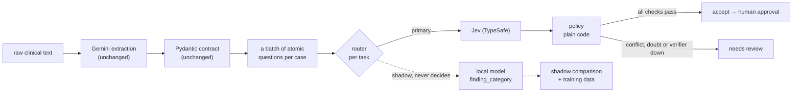

# Decision layer: Jev now, our own models next

This note covers what was added after the interview: a decision layer that checks
every LLM extraction, with Jev (TypeSafe) as the primary verifier when verification is
enabled, and our own small models trained alongside it. It explains why, how it works, what was measured, and what
has not been proven yet.

## The problem

Today one Gemini call does everything: it reads the clinical text and writes the
whole case — title, presentation, findings, the category of each finding, the
diagnoses and which one is established.

Only part of that is generation. The rest is classification with a fixed answer set:

| Question | Answer space | Needs a generative LLM? |
|---|---|---|
| Write a title and a presentation | free text | yes |
| Pull the findings out of a narrative | open-ended list | yes, for now |
| Which category is this finding? | 7 labels | no |
| Is this finding actually in the source? | supported / contradicted / not stated | no |
| Is this diagnosis established or a differential? | 4 labels | no |
| Does the title give the diagnosis away? | yes / no | no |

Pydantic catches broken structure, but not a well-formed lie: a finding the text
never mentions, a differential recorded as the answer, or a title that names the
diagnosis. Those were only caught by a person reading the case.

Asking Gemini the same bounded questions again would work, but it is the expensive
tool for a cheap job. The aim is to answer each bounded question with the cheapest
thing that is good enough, in this order: plain code, then a small model of our
own, then Jev, then Gemini or a person.

## What Jev is

[Jev](https://typesafe.ai/blog/introducing-system-one-models-and-jev) is TypeSafe's
"System One" model. It does not generate text. You give it a state (here, the source
text) and a set of named questions, and it answers each one in a fixed format:

- `Choice`: one label from a fixed set, plus a probability per label and a confidence
- `Noul`: a single probability of "yes"
- `Score`: a level on an ordered scale (not used here)

All questions for one case go in one request and are answered in parallel.

What matters for this project, all from [docs.typesafe.ai](https://docs.typesafe.ai/models) (checked 2026-10-06):

- `jev-latest` points to `jev-1.13.0`. Input costs $0.042 per million tokens; output is free.
- Context limit: 64k tokens per request.
- It is a hosted API. The weights are shared by every customer and are not fine-tuned
  on customer data, so there is nothing of ours to train or download. Jev is a
  ready-made decision layer, not a model we own.
- TypeSafe themselves say: keep control flow in code, split decisions into atomic
  questions, and do not use Jev for arithmetic, counting or text generation.
- Confidence is a summary of how clearly the top label wins. It is not calibrated
  accuracy, and TypeSafe recommend choosing thresholds on your own data.

That last pair of points shaped the design: Jev answers questions, code decides
what to do with the answers, and thresholds are treated as unproven until measured.

## What was built



Scoring participants' answers is not part of this flow and does not change. It stays
deterministic, in the backend, with no model involved.

### Five kinds of check

Defined once in `decisioning/tasks.py`, shared by every provider, versioned. A case
gets one question per finding for support and for category, one per diagnosis, one
each for the title and the presentation, and one for completeness: a batch of
2 × findings + diagnoses + 3, sent in a single request.

| Task | Labels | Catches |
|---|---|---|
| `finding_support` | supported, contradicted, not_stated | invented or misread findings |
| `finding_category` | the 7 finding categories | wrong category |
| `diagnosis_status` | established, differential, excluded, not_stated | a differential stored as the answer, an invented diagnosis |
| `diagnosis_leak` | yes / no | a title or presentation that gives the answer away |
| `finding_completeness` (experimental) | complete, likely_incomplete | findings the source states but the extraction missed |

Support checks what was extracted (precision). Completeness checks what was left out
(recall), which is where the live Gemini run loses most. It is marked experimental:
judging "is anything relevant missing" is a broader question than the others, and
whether Jev answers it reliably has not been measured yet.

Jev today, a local model tomorrow and a human reviewer all work against the same
labels and descriptions. Change a label's meaning and the task version changes, so
old predictions and old training data are never mixed with new ones.

### Rules that hold everywhere

- **Providers answer, they never edit.** If Jev disagrees with Gemini, the case goes
  to review. Nothing is silently corrected.
- **Doubt means review.** Confidence below the threshold is a reason for a person to
  look, not a reason to guess. That includes a leak check that is unsure of its own
  "no". A likely leak has its own, lower bar and is flagged either way.
- **Fail closed.** If the verifier is down, the case is marked `needs_review` with
  the reason `unavailable`. It is never accepted unchecked.
- **Accept is not publish.** `accept` means the automatic checks passed. A person
  still approves every LLM-extracted case.
- **No clinical text in logs.** Reasons and decisions carry positions (`findings[2]`)
  and labels only. The TypeSafe SDK logs request bodies at debug level, so its logger
  is pinned to WARNING.
- **Synthetic data only.** Real patient data goes to Jev only after a privacy and
  security review confirms PHI use is permitted and the required contractual controls,
  including a BAA where applicable, are in place. TypeSafe publishes a DPA and offers
  zero data retention for enterprise; I found no public statement on a BAA.
- **One call per provider per case.** Mid-migration a provider can be primary for some
  tasks and shadow for others. The router plans calls by provider, so it is still one
  request, and the answers are split by role afterwards.
- **The exact model is recorded.** Each decision carries the model that actually
  answered (`jev-1.13.0`), and eval reports keep both the requested alias
  (`jev-latest`) and the resolved versions, so a committed result stays reproducible
  after the alias moves.

### Code layout

```
llm_pipeline/src/clinical_extraction/
  decisioning/
    tasks.py          the checks, their labels and versions
    queries.py        candidate case -> atomic questions
    providers/
      base.py         DecisionProvider: one contract for Jev, local and fake
      typesafe.py     thin adapter over typesafe-sdk, one request per case
      local.py        serves our trained models
      fake.py         deterministic, for tests and CI
    router.py         per-task primary and shadow
    policy.py         accept / needs_review rules
    verifier.py       questions -> router -> policy -> report
  ml/
    records.py        labelled records, where each label came from
    datasets.py       build task datasets, split by case
    features.py       word + character n-grams, pure Python
    model.py          JSON artifact + manifest, loading and integrity check
    train.py          training (optional `ml` dependency group)
    evaluation.py     held-out metrics and the promotion gate
  pipeline.py         extraction, then optional verification
  evals/decisions.py  verifier eval on clean and broken cases
llm_pipeline/models/finding_category/   the trained model and its manifest
llm_pipeline/training/                  synthetic seed data
```

`ClinicalCaseExtractor` is unchanged. Verification is a separate step after it and
is off unless asked for (`extract --verify typesafe`).

## Our own models, from day one

Jev is the starting point, not the destination. Its weights are not ours, it is one
more external call per case, and it cannot learn from our reviews. So the same PR
lays the foundation for replacing it task by task.

### Records and labels

Every training record says where its label came from:

| Source | Trusted for training and eval |
|---|---|
| `human_reviewed` | yes |
| `synthetic_ground_truth` (the eval set) | yes |
| `synthetic_seed` (hand-written phrases) | yes, train only |
| `weak_label` (any model's prediction, Jev's included) | no |

Jev's answers are never ground truth and never training data. Training a local
model to copy Jev and then calling it good because it agrees with Jev would measure
nothing, and using a vendor's outputs to build a replacement is a contractual question
in its own right. Model predictions are kept only to find disagreements and to decide
what a person should review next.

The split is made by vignette (`case_group_id`). Every record from one case sits on
one side only, so variants of the same case cannot leak from training into the test.

### The first model: finding category

Chosen first because it has a closed label set, existing labels, a clear metric and
no generation involved.

- Features: word 1–2-grams plus character 3–5-grams, digits mapped to `0` so
  `118/min` and `96/min` look alike.
- Model: TF-IDF + logistic regression (scikit-learn). Deliberately the simplest real
  baseline. Anything bigger has to beat it first.
- Artifact: plain JSON, not a pickle, so loading it cannot run code and a diff shows
  what changed. The manifest stores the dataset fingerprint, the hyperparameters,
  held-out metrics, the gate result and the SHA-256 of the weights. A mismatch is
  refused at load time.
- Inference is plain Python. The runtime image has no numpy or scikit-learn.
- Out-of-distribution guard: if less than 30% of a text's features were seen in
  training, the softmax answer is mostly intercept, so its confidence is set to 0 and
  the policy sends it to review.
- A test retrains the model and checks it matches the committed one. If the data
  changes and nobody retrains, CI fails.

### The promotion gate

A local model may not answer for real until it passes, and the router enforces that
in code:

| Condition | Value |
|---|---|
| held-out examples | at least 200 |
| held-out accuracy | at least 0.95 |
| held-out macro F1 | at least 0.90 |

Passing is necessary, not sufficient. After that the model still runs in shadow
next to Jev on real traffic, and only a clean comparison there moves the task.

### Migration, one task at a time

| Phase | finding_category | other tasks | Moves on when |
|---|---|---|---|
| 1 (now) | Jev primary, local shadow | Jev | — |
| 2 | Jev primary, local shadow | Jev | reviewed data grows, local passes the offline gate |
| 3 | local primary, Jev shadow | Jev | shadow agreement and review outcomes hold for an agreed period |
| 4 | local only | next task starts at phase 1 | Jev kept as a sampled audit, then removed from the hot path |
| 5 | local | local | Jev used only for audits and for new tasks |

Each step is one route change in `router.py`. The pipeline and the policy do not change.

### The data flywheel

```
synthetic ground truth + seeds
  → Jev primary, local shadow
  → disagreements and low-confidence cases first in the review queue
  → human labels (trusted)
  → versioned dataset → retrain → held-out eval → gate
  → shadow on live traffic → route change
```

Reviewing disagreements first is the cheapest way to get useful labels: those are
exactly the examples the current model gets wrong or is unsure about.

### Next models, if the baseline is not enough

Only after a benchmark shows the simple baseline falls short:

| Option | Fits | Why consider it |
|---|---|---|
| Rules (regex, spaCy `EntityRuler`) | age, sex, units, vitals | free, exact, explainable |
| [SetFit](https://huggingface.co/docs/setfit) | finding category | built for small labelled sets, no prompts |
| [ModernBERT-base](https://huggingface.co/blog/modernbert) (149M) | support, status, leak as text-pair tasks | an encoder, cheap on CPU, long context |
| [NuExtract 1.5 tiny](https://huggingface.co/numind/NuExtract-1.5-tiny) (0.5B, MIT) | the extraction itself | a small model trained for text → JSON template |
| Jev probabilities as features + logistic regression or CatBoost | `needs_review` | TypeSafe's own suggested pattern, classic ML on top |
| ONNX export + quantisation | any of the above | only once a model has proven itself |

## What was measured

All numbers come from committed code and can be re-run.

### 1. Baseline: Gemini alone, live

`extract-v2` on `gemini-2.5-flash`, all ten vignettes, 2026-10-06
(`llm_pipeline/evals/results/gemini-2.5-flash-extract-v2.json`):

| Metric | Value |
|---|---|
| schema valid | 10 / 10 |
| age / sex | 1.0 / 1.0 |
| answer key | 0.9 |
| findings F1 (token overlap) | 0.51 |
| category accuracy on matched findings | 0.97 |
| latency p50 / p95 | 4.0 s / 7.7 s |
| tokens per case | ~431 in / ~302 out (thinking tokens not included) |

Gemini is already good at categories. The weak spot is the findings list:
precision 0.44 and recall 0.61. `finding_support` targets the first (findings the
source does not state). `finding_completeness` targets the second (findings the
extraction dropped), and is the experimental check to watch in the first live Jev run.

### 2. The verifier, offline

`eval-decisions` runs every vignette clean and with one planted defect at a time:
10 clean candidates, 60 broken ones. The verifier here is a reference built from the
ground truth with two deliberate misjudgments, so this measures the checks, the
policy and the harness, not Jev (`decision-eval-reference.json`):

| Metric | Value |
|---|---|
| defect detection recall | 0.98 (59 / 60) |
| dropped finding caught | 10 / 10 |
| false accept rate | 0.02, the planted title-leak miss |
| clean pass rate | 0.9, the planted low-confidence case goes to review |
| caught by the check meant for it | 0.98 |
| verifier outages accepted | 0 |

CI fails if recall drops below 0.95 or the clean pass rate below 0.85. Both rates
are always shown together: a verifier that flags everything has perfect recall and
is useless (there is a test for exactly that).

### 3. Our finding-category model

Trained on 84 seed phrases and the findings of 7 vignettes, scored on the findings
of 3 held-out vignettes it never saw:

| Metric | Value |
|---|---|
| held-out accuracy | 0.60 (12 / 20) |
| held-out macro F1 | 0.54 |
| accuracy on its own training vignettes | 1.0 |
| agreement with the primary verifier (shadow) | 0.88 over 69 findings |
| promotion gate | **failed**: 20 examples < 200, accuracy < 0.95, F1 < 0.90 |

So it stays in shadow, which is the point of the gate. The gap between 1.0 on
training data and 0.6 on unseen cases is the honest picture of 153 examples, and
most misses are history and symptom phrased without telltale words. The fix is more
reviewed labels, not a bigger model: that is what the shadow phase and the review
queue are for. Hyperparameters were set before looking at held-out results and were
not tuned on them.

### 4. Jev, live

Not run: no TypeSafe key was available. One command produces it
(`make eval-jev`), and the file name is reserved:
`llm_pipeline/evals/results/jev-decisions.json`.

## Cost, honestly

Adding a verifier makes every case slightly more expensive, not cheaper. What this
stage buys is checking, a confidence signal, and labelled data for the next stage.

Per case, with list prices as of 2026-10-06 (override them in settings, they change):

| | Tokens per case | USD per 1,000 cases |
|---|---|---|
| Gemini 2.5 Flash extraction (measured) | ~431 in, ~302 out | ~0.88, a lower bound: thinking tokens are billed but not counted here |
| Jev verification (estimated from request size) | ~2,400 in, output free | ~0.10 |

So verification is estimated, not yet measured, to add roughly a tenth to the cost and one more network call after a
four-second extraction. Most of the Jev request is the label descriptions repeated
for every finding; trimming them is the obvious first optimisation once live numbers
exist.

Savings come from the next stage, a cascade:

```
cheap extractor (NuExtract tiny or similar)
  → Pydantic → Jev or local verification
  → passes: done                          (most cases, near-free)
  → flagged: Gemini, then verification again
```

Cost per case ≈ cheap extraction + verification + (share escalated × Gemini). It
pays off only if the share escalated stays low at the same false-accept rate. That
has to be measured with the same harness before anyone claims it.

## Limitations

- Ten synthetic vignettes are a smoke test, not clinical validation. Every number
  here is about the pipeline working, not about medical accuracy.
- The verifier eval runs offline against a reference verifier built from the ground
  truth. It proves the checks, the policy and the harness. It says nothing about how
  good Jev is.
- Jev has not been run live: no TypeSafe key was available. The adapter is tested
  against the real SDK with a mocked HTTP layer.
- The completeness check is experimental. Offline it is checked against a reference
  that knows the ground truth; whether Jev judges it well is the open question.
- Thresholds (`MIN_CONFIDENCE=0.5`, `LEAK_FLAG_PROBABILITY=0.5`) are starting points.
  They are calibrated on a dev split and confirmed on held-out data before production.

## How to run it

```bash
cd llm_pipeline && uv sync

# Offline, no credentials: the verifier eval and the local model
uv run clinical-extraction eval-decisions
uv run clinical-extraction eval-local --task finding_category

# Retrain the local model (adds numpy and scikit-learn)
uv sync --group ml
uv run clinical-extraction train-local --task finding_category

# Live, with a TypeSafe key
export TYPESAFE_API_KEY=...
uv run clinical-extraction eval-decisions --provider typesafe --output evals/results/jev-decisions.json
uv run clinical-extraction extract --file case.txt --verify typesafe
```
